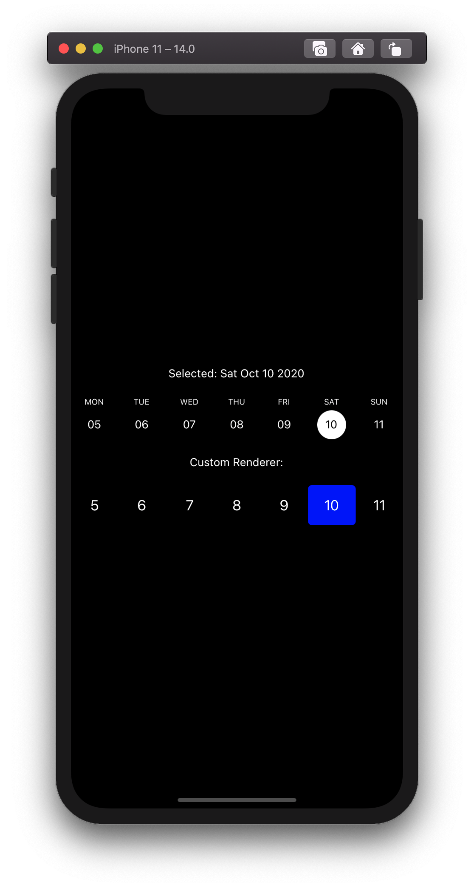
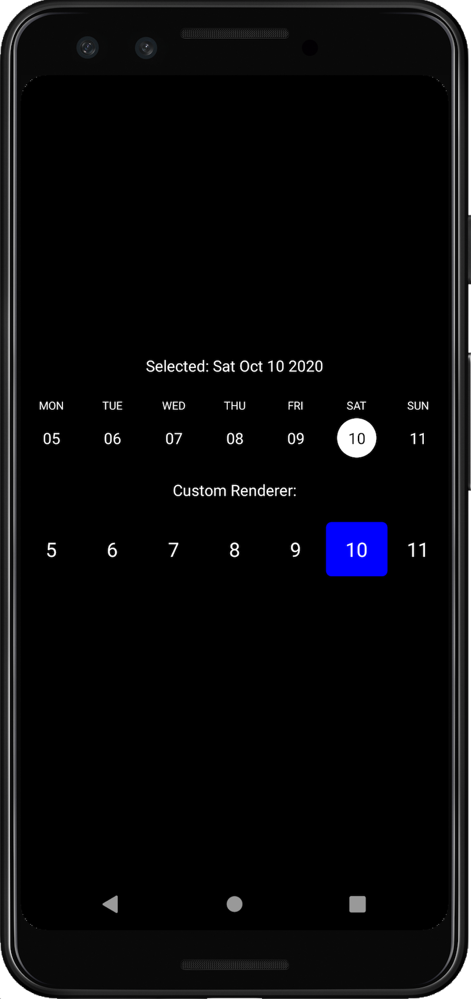

# react-native-week-strip

A simple paginated week strip for React Native.

| iOS          | Android          |
| ------------ | ---------------- |
|  |  |

## Installation

```sh
npm install react-native-week-strip
```

or if you're using Yarn

```sh
yarn add react-native-week-strip
```

## Usage

```js
import WeekStrip from 'react-native-week-strip';

// ...

export default function App() {
  const [date, setDate] = React.useState(new Date('October 10, 2020 03:24:00'));

  return (
    <View>
      <Text>Selected: {date.toDateString()}</Text>
      <WeekStrip
        startDate={new Date('September 15, 2020 03:24:00')}
        endDate={new Date('October 15, 2020 03:24:00')}
        date={date}
        onDateChange={setDate}
        allowSelectingFuture
      />
    </View>
  );
}
```

## Contributing

See the [contributing guide](CONTRIBUTING.md) to learn how to contribute to the repository and the development workflow.

## License

MIT
